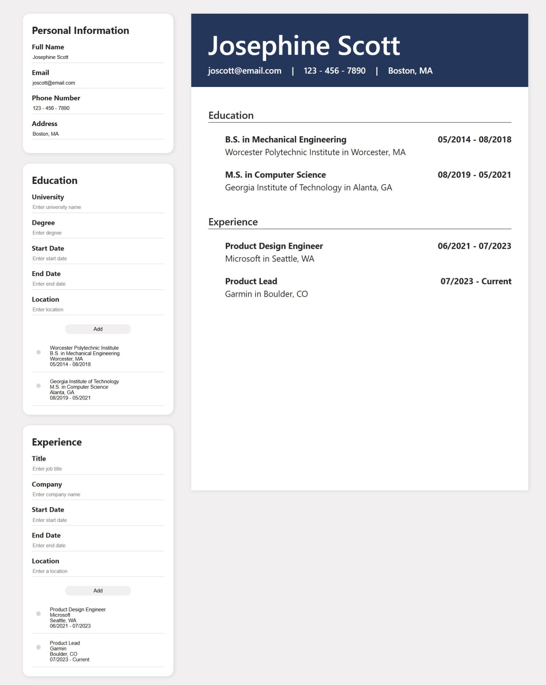

# The Odin Project - React CV Application

This is my solution to the [CV Application project on The Odin Project](https://www.theodinproject.com/lessons/node-path-react-new-cv-application). The Odin Project is a free open-source coding curriculum that provides a comprehensive study path for aspiring developers. 

## Table of contents

- [Overview](#overview)
  - [Screenshot](#screenshot)
  - [Links](#links)
- [My process](#my-process)
  - [Built with](#built-with)
  - [What I learned](#what-i-learned)
  - [Continued development](#continued-development)
  - [Useful resources](#useful-resources)
- [Author](#author)

## Overview

### The challenge

Create an application in React where users can input their information and generate a mock up of a CV/resume. 

### Screenshot

#### Final Screenshot

#### Wireframe

### Links

- Solution URL: [https://github.com/colleennicole223/odin-cv-application](https://github.com/colleennicole223/odin-cv-application)
- Live Site URL: [https://colleennicole-cv-application.netlify.app/](https://colleennicole-cv-application.netlify.app/)

## My process

### Built with

- Figma (wireframe)
- Vite, React, and Node.js

### What I learned

- React
  - Creating react components
  - Using keys in react when tracking simple id's
  - Using props, and functions as props
  - Passing in states and properties between components
- CSS
  - Can set ratio with `aspect-ratio` 
- Overall 
  - Deploying a Static Site (Netlify)

### Continued development

Would be interested in, 
  - Adding a download feature
  - Adding layout options for the user to select 
  - Zoom in & out feature for ease of viewing 

### Useful resources

1. Can create vite in existing folder using, `npm create vite@latest ./` from [Reddit](https://www.reddit.com/r/webdev/comments/pk92o7/use_vite_in_the_current_directory/)
2. ChatGPT for smaller notation such using `.filter` or how to approach `handleInputChange` functions

## Author

- Personal Website - [Colleen Nicole](https://www.colleennicole.com)
- Odin Website - [The Odin Project](https://www.theodinproject.com)
