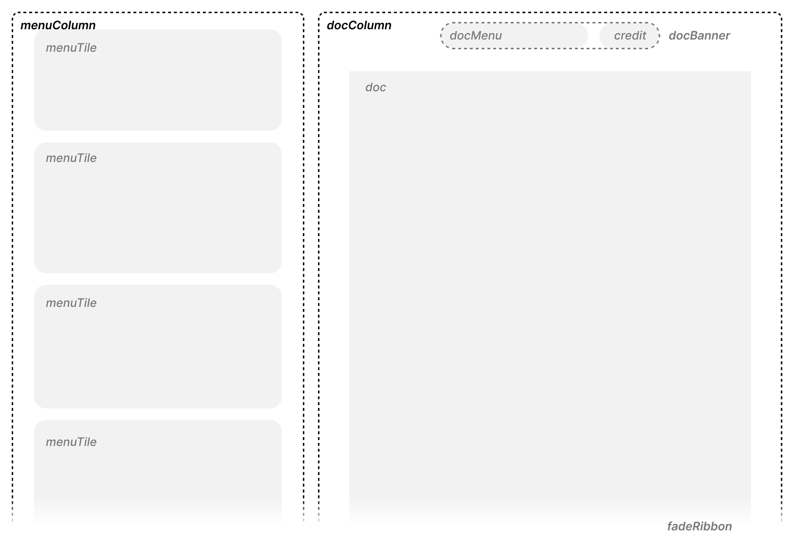

# The Odin Project - React CV Application

This is my solution to the [CV Application project on The Odin Project](https://www.theodinproject.com/lessons/node-path-react-new-cv-application). The Odin Project is a free open-source coding curriculum that provides a comprehensive study path for aspiring developers. 

## Table of contents

- [Overview](#overview)
  - [Screenshot](#screenshot)
  - [Links](#links)
- [My process](#my-process)
  - [Built with](#built-with)
  - [What I learned](#what-i-learned)
  - [Continued development](#continued-development)
  - [Useful resources](#useful-resources)
- [Author](#author)

## Overview

### The challenge

Create an application in React where users can input their information and generate a CV/resume. 

### Screenshot

#### Final Screenshot

#### Wireframe

### Links

## My process

### Built with

- Figma (wireframe)
- Vite, React, and Node.js

### What I learned

- React
  - Practiced passing in properties into and between components
- CSS
  - Can set ratio with `aspect-ratio`

### Continued development

### Useful resources

1. Can create vite in existing folder using, `npm create vite@latest ./` from [Reddit](https://www.reddit.com/r/webdev/comments/pk92o7/use_vite_in_the_current_directory/)

## Author

- Personal Website - [Colleen Nicole](https://www.colleennicole.com)
- Odin Website - [The Odin Project](https://www.theodinproject.com)
